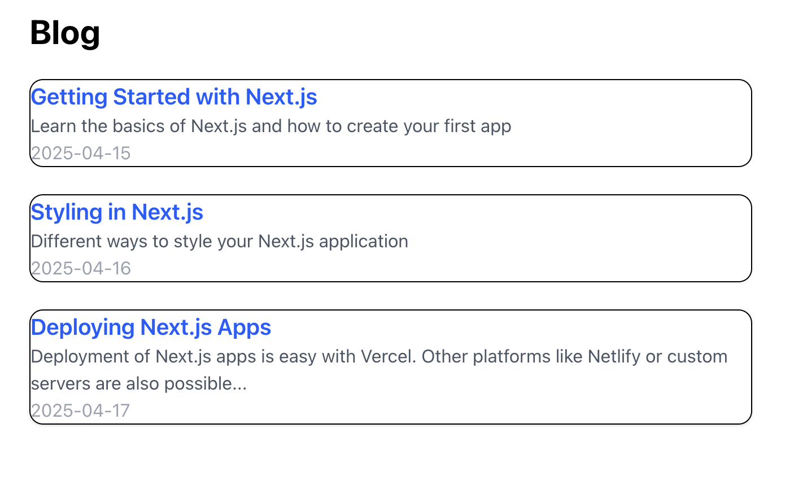
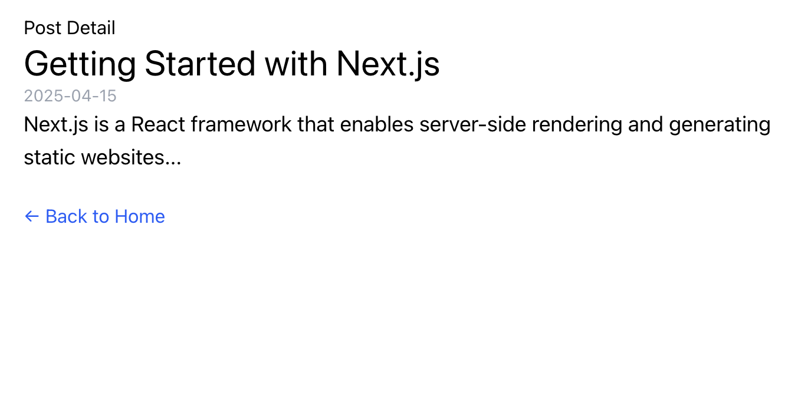

# 📝 Next.js Simple Blog

A minimalist blog built using **Next.js** and **Tailwind CSS**, featuring dynamic routing, API routes, and static data. This project is great for learning how to combine frontend UI with backend-like functionality in a fullstack React app.

---

## 🚀 Features

- 📚 List and view blog posts
- 📦 API routes for blog data (`/api/posts`, `/api/posts/[id]`)
- 🧩 Dynamic routing with `pages/posts/[id].jsx`
- 🎨 Styled using Tailwind CSS
- 🧱 Easily extendable structure

---

## 📁 Project Structure

### Display a list of blog posts with titles and excerpts

### Blog Post Page

