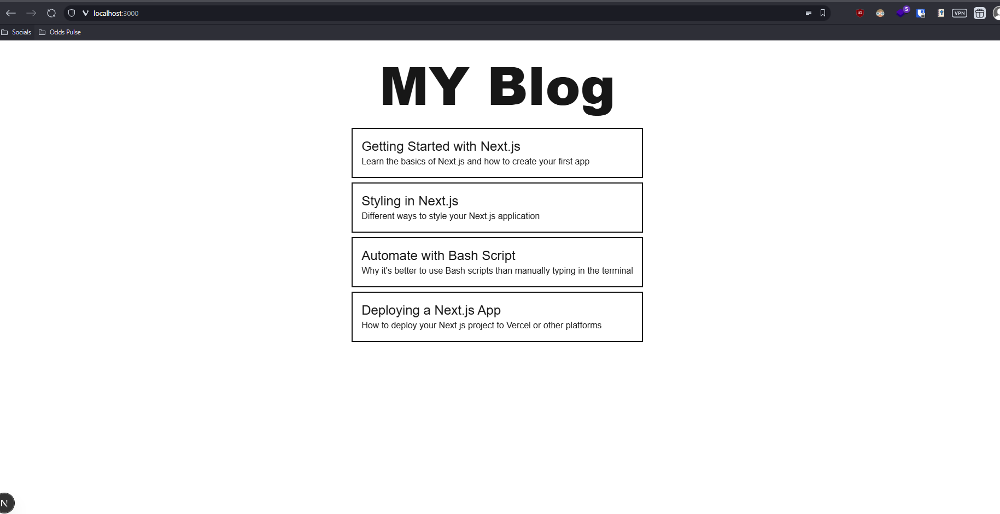
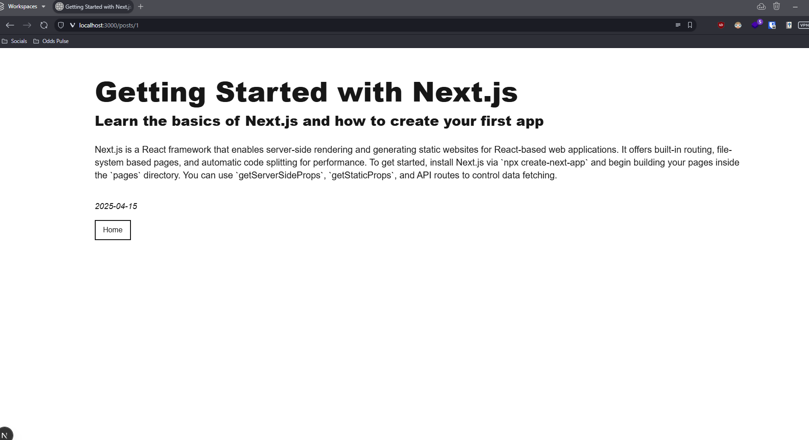

# This is simple Blog Page using Next js from code assesment by codebility

## Usage
```bash
npm run test   # unit test with jest
npm run build 
npm run start
```

## Simple Architecture Implementation
app(UI/HTTP) -> controller (interface-adapter) -> infra (shared services)
inspired by [Uncle Bob](https://blog.cleancoder.com/uncle-bob/2012/08/13/the-clean-architecture.html) and tech guru implementing next js clean architecture.

### Sample Result
```bash
curl http://localhost:3000/api/posts
# content and date are not included
{"data":[{"id":1,"title":"Getting Started with Next.js","excerpt":"Learn the basics of Next.js and how to create your first app"},{"id":2,"title":"Styling in Next.js","excerpt":"Different ways to style your Next.js application"},{"id":3,"title":"Automate with Bash Script","excerpt":"Why it's better to use Bash scripts than manually typing in the terminal"},{"id":4,"title":"Deploying a Next.js App","excerpt":"How to deploy your Next.js project to Vercel or other platforms"}]}
```

```bash
$ curl http://localhost:3000/api/posts/1

{"data":{"id":1,"title":"Getting Started with Next.js","excerpt":"Learn the basics of Next.js and how to create your first app","content":"Next.js is a React framework that enables server-side rendering and generating static websites for React-based web applications. It offers built-in routing, file-system based pages, and automatic code splitting for performance. To get started, install Next.js via `npx create-next-app` and begin building your pages inside the `pages` directory. You can use `getServerSideProps`, `getStaticProps`, and API routes to control data fetching.","date":"2025-04-15"}}
```


